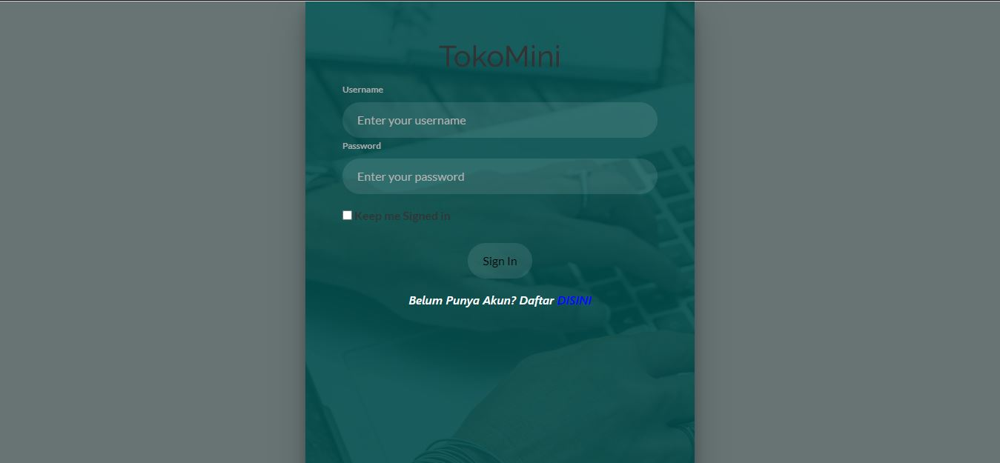
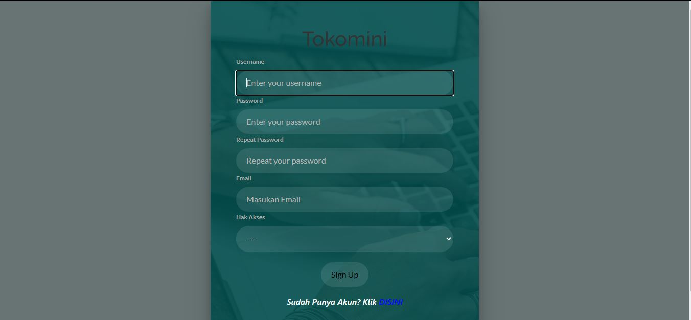
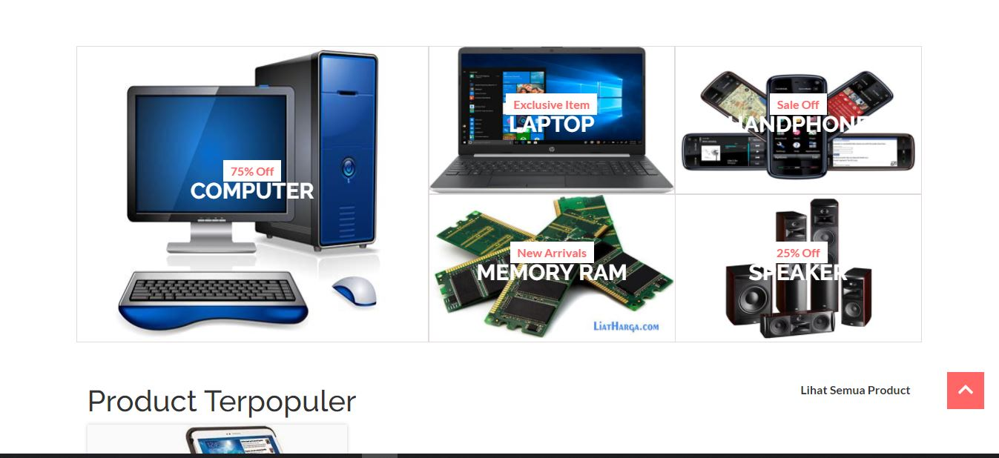
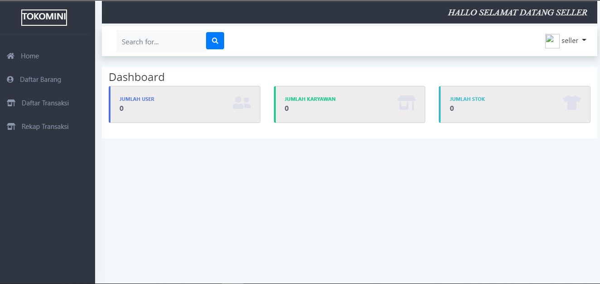
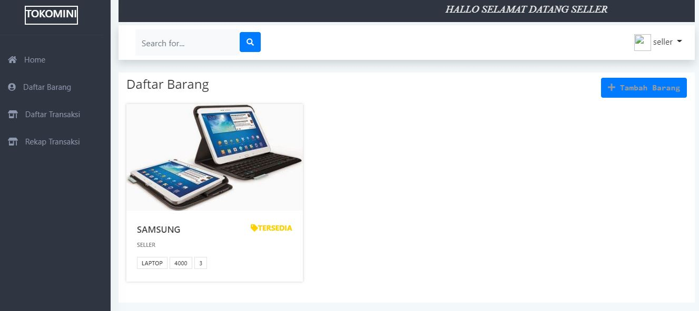

How To Install:
1. git clone https://fheryfebrians/tokomini.git
2. cd tokomini
3. composer install
4. cp .env.example .env
5. php artisan key:generate
6. set database in file .env
7. php artisan migrate
8. php artisan serve or localhost/tokomini/public

Aplikasi Toko Mini ini dibangun menggunakan framework laravel
terdapat 2 hak akses yaitu sebagai seller dan customer
mempunyai halaman login dan register yang sama namun memiliki home page yang berbeda ketika login
Hak Akses:
1. Seller
	- seller dapat mengelola transaksi (CRUD) dan merubah status transaksi yang dibuat dengan 2 pilihan terima dan tolak
	- dapat melakukan CRUD terhadap barang
	- dapat melihat rekap transaksi harian dan bulanan
2. Customer
	- dapat melihat barang yang dijual oleh seller
	- searching berdasarkan nama barang
	- dapat melihat barang per kategori
	- melakukan transaksi
	- melihat daftar transaksi yang sudah dilakukan

# Halaman Login 

# Halaman Register 

# Home Customer 

# Home Seller 

# Product
# Index

# Add

# Edit Detail

